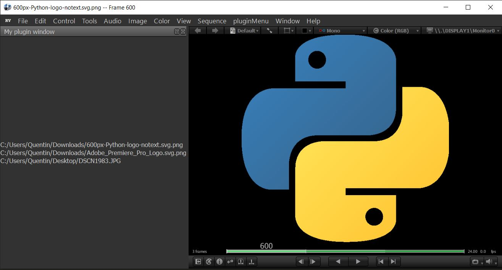

# RV plugin boilerplate
This repo aims to provide a template and some explanations for TDs wanting to quickly create a RV plugin.

_This is the result of the start code, a Qt widget populated by paths when new sources are added (include basic menu + basic settings)_

### Setup
  - copy the content of the `code` directory of this repo to somewhere in your source code repository   
  - create a **rvpkg** using this command `zip my_package-0.0.rvpkg PACKAGE my_code.py` (or a tool like 7zip/winRar)
  The .rvpkg file is the proper way to install a plugin in RV, it should contain everything needed for the plugin.
  - install the rvpkg by starting RV, going in RV > Preferences... > Packages > Add packages...    
  RV will show you were the package is going to be installed, keep note of this path
  - check the `Installed` and `Load` checkboxes in the package list     
  After restarting RV you should see the new menu
  - to edit our plugin, we can write in the python file in the installation directory under the Python folder    
  This avoid creating a new package and reinstalling it using the UI.
  You have to restart RV to see any change to the .py file, I didn't find a way to reload the plugin inside RV.    
  A simple reloadPlugin.sh script is provided in this repo to quicly reload RV with updated py for testing purposes.

### Code
The code folder contains 2 files :
  - PACKAGE : this file is mandatory and should be named like this, it contains a description of our plugin
  - my_code.py : fell free to rename it, this is the actual python code

Any `print` statements in the python code will be in the RV console (Window > Console) or in the terminal which launched the RV process.

### Ressources
- python quickstart : https://support.shotgunsoftware.com/hc/en-us/articles/219042308-RV-Python-quickstart
- main documentation on plugins : https://support.shotgunsoftware.com/hc/en-us/articles/360024280254-Reference-Manual

### Disclaimer
Code is provided as is, with no guaranty/support  
It was tested on RV 7.1.1 on win10 and RV 7.3.1 on linux